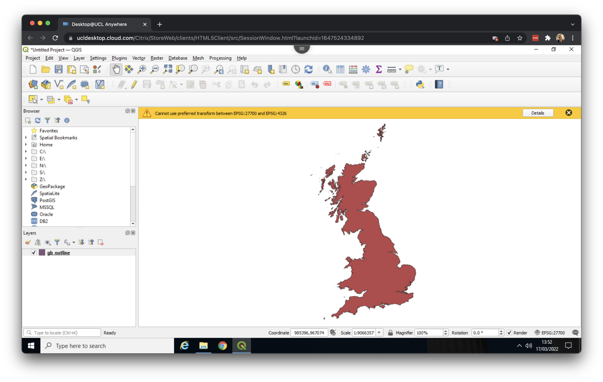

--- 
title: "Analysis and visualisation of surname data"
author: Created by [Justin van Dijk](https://mappingdutchman.com/)
date: "Last modified: `r Sys.Date()`"
site: bookdown::bookdown_site
output: bookdown::gitbook
documentclass: book
link-citations: yes
github-repo: "jtvandijk/GEOVIS22"
description: "Geovisualisation Spring School."
url: 'https\://jtvandijk.github.io/GEOG0014/'
---

# (PART\*) Welcome {-}
# Getting started {-}

```{r welcome, echo=FALSE, out.width = "100%", fig.align='center', cache=TRUE,}
knitr::include_graphics('images/general/surname_welcome.jpeg') 
```
<br />

Welcome! In this session of the 2022 International Spring School on Visualisation we will be mapping **surnames** across Great Britain. The Lecture *What’s in a name? Visualising surname geographies in a GIS environment* should have given you a good introduction onto why we would want to do this, but in case you want some further details on previous work using surnames in an analytical context you may want to have a look at some of the papers in the **background reading** section listed below.

### Background readings {-}
- Cheshire, J. and Longley, P. A. 2011. Identifying spatial concentrations of surnames. *International Journal of Geographical Information Science* 26(2), pp.309-325. [[Link]](https://doi.org/10.1080/13658816.2011.591291)
- Kandt, J., Van Dijk, J. T., and Longley, P. A. 2020. Family name origins and inter-generational demographic change in Great Britain. *Annals of the American Association of Geographers* 110(6), pp.1726-1742. [[Link]](https://doi.org/10.1080/24694452.2020.1717328)
- Lansley, G., Li, W. and Longley, P. A. 2019. Creating a linked consumer register for granular demographic analysis. *Journal of the Royal Statistical Society: Series A (Statistics in Society)* 182(4), pp.1587-1605. *Open access*. [[Link]](https://doi.org/10.1111/rssa.12476)
- Longley, P. A., Van Dijk, J. T., and Lan, T. 2021. The geography of intergenerational social mobility in Britain. *Nature Communications* 12(6050). *Open access*. [[Link]](https://doi.org/10.1080/13658816.2011.591291)
- Van Dijk, J. T., Lansley, G., and Longley, P. A. 2021  Using linked consumer registers to estimate residential moves in the United Kingdom. *Journal of the Royal Statistical Society: Series A (Statistics in Society)* 184(4), pp.1452-1474. *Open access*. [[Link]](https://doi.org/10.1111/rssa.12713)
- Van Dijk, J. T. and Longley, P. A. 2020. Interactive display of surnames distributions in historic and contemporary Great Britain. *Journal of Maps* 16, pp.58-76. *Open access*.  [[Link]](https://doi.org/10.1080/17445647.2020.1746418) 

### Session format {-}
This computer practical consists of four sections. Each section should take you around **20 minutes** to complete, depending on your familiarity with GIS you may take longer or shorter. After each section you should pause, and we will jointly go through all the steps and instructions. This allows everyone without some GIS familiarity to catch-up, if necessary, and everyone with some GIS experience to play around with additional visualisation options and the opportunity to gain a more in-depth understanding of the processes and methods underlying these visualisations.

Some general pointers:

- The instructions provided are based on [QGIS 3.16](https://qgis.org/en/site/forusers/download.html) (long term release) for [Windows](https://www.microsoft.com/en-gb/windows?r=1). These instructions should be (almost) identical for most QGIS 3.x versions as well as for most operation systems (specifically [macOS](https://www.apple.com/uk/macos/monterey/)). That being said: there may be some small differences here and there in terms of how the actual windows and tabs may look like. 
- Read the instructions carefully and use the animated GIFs to determine what is happening in each of the individual steps, especially if there are some small differences between your own installation of QGIS and the instructions provided.
- Use the Menu / Table of Contents / sidebar on the left-hand side of this page to navigate through the individual sections. 
- Take your time. If you feel like you are falling behind, do not worry, try to get along as good as you can. This resource will remain available for the foreseeable future so you can always come back and try it again at your own pace.

:::note
**Note** <br />
You can hide and show the sidebar (Table of Contents) of this webpage with the **Toggle Sidebar** button in the menu bar at the top of the page.
:::

# (PART\*) Section 1 {-}
# Loading data 
## QGIS installation
Some of you may already have played around with some GIS software such as [ArcGIS](https://www.arcgis.com/index.html), but today we will be using the open-source GIS software suite [QGIS](https://www.qgis.org/en/site/). If you have not already done so, you can download a copy of QGIS to your own computer through the [QGIS webpage](https://qgis.org/en/site/forusers/download.html).

```{r qgis-download, echo=FALSE, fig.align='center', out.width='850pt', fig.cap='Download page for QGIS. [[Enlarge image]](https://jtvandijk.github.io/GEOVIS22/images/geovis/qgis_download.png){target="_blank"}'}

```

:::note
**Note** <br />
The instructions provided are based on [QGIS 3.16](https://qgis.org/en/site/forusers/download.html) (long term release) for [Windows](https://www.microsoft.com/en-gb/windows?r=1). These instructions should be (almost) identical for most QGIS 3.x versions as well as for most operating systems (specifically [macOS](https://www.apple.com/uk/macos/monterey/)). That being said: there may be some small differences here and there in terms of how the actual windows and tabs may look like.
:::

## Data preparation 
We have prepared several datasets with the locations of the bearers of five different surnames (*Longley*, *Van Dijk*, *Novak*, *Smith*, and *Rossall*) that are present in Great Britain in 2016. In addition to the surname data, we also prepared a dataset containing the simplified boundaries of Great Britain and a dataset containing the names of locations of several large cities. We will use these simplified boundaries and cities to contextualise our map. 

:::note
**Note** <br/>
For privacy reasons the surname data you will be using are not actual data but are made to closely represent the actual data.
:::

Download both files to the `Downloads` folder on computer by following the links below.

#### File download {-}
| File                                                 | Type            | Link |
| :------                                              | :------         | :------ |
| XY locations for selected surnames                   | `zip` `csv`     | [Download](https://github.com/jtvandijk/GEOVIS22/tree/master/data/surname_data.zip){target="_blank"} |
| XY locations of selected cities in Great Britain     | `zip` `shp`     | [Download](https://github.com/jtvandijk/GEOVIS22/tree/master/data/gb_cities.zip){target="_blank"} |
| Simplified boundaries of Great Britain               | `zip` `shp`     | [Download](https://github.com/jtvandijk/GEOVIS22/tree/master/data/gb_outline.zip){target="_blank"} |

After downloading all three files, go to your `Downloads` folder and make you unzip both files:

- On Windows you can do this by right clicking on the `surname_data.zip` and `gb_outline.zip` folders and opting for **Extract all**. 
- On macOS you can double click on the zipped folders to extract them. 

The data, which was stored in a compressed format (`zip`), should now be extracted and ready for use within QGIS. Your `Downloads` folder should look something like this:

```{r download-dir, echo=FALSE, fig.align='center', out.width='850pt', fig.cap='Your `Download` folder should now contain three **unzipped** folders containing our surname data and our reference data. [[Enlarge image]](https://jtvandijk.github.io/GEOVIS22/images/geovis/download_dir.png){target="_blank"}'}
knitr::include_graphics('images/geovis/download_dir.png')
```

The final step we need to take is to copy our downloaded data to a new folder. In your `Documents` folder on your computer, create a new folder `GEOVIS22`. We will use this folder as our *working directory*. Now move all folders containing the surname data, the Great Britain outline data and the citie data that you unzipped from your `Downloads` folder to this new `GEOVIS22` folder. Your working directory should look like something like this:

```{r wd-dir, echo=FALSE, fig.align='center', out.width='850pt', fig.cap='Your working directory is now all set up. [[Enlarge image]](https://jtvandijk.github.io/GEOVIS22/images/geovis/wd_dir.png){target="_blank"}'}
knitr::include_graphics('images/geovis/wd_dir.png')
```

:::note
**Note** <br/>
The `gb_outline` and `gb_cities` files that we downloaded are something called a `shapefile.` A `shapefile` is a file that GIS software uses to store spatial data. In the case of a shapefile this is in actual fact a misnomer because a `shapefile` consists of a **collection of files**. Without going into detail: each of these files does something slightly different and the the software we will be using requires needs all of them in order to understand the data.
:::

## Adding data 
Now we have downloaded and organised our data, we can open QGIS. QGIS is a free and open-source cross-platform desktop geographic information system application that supports viewing, editing, and analysis of geospatial data. Start QGIS. It may take a little while before QGIS has started, so be patient. Once opened, you will see the QGIS interface which will look something like this:

```{r qgis-interface, echo=FALSE, fig.align='center', out.width='850pt', fig.cap=' The QGIS interface on Windows. [[Enlarge image]](https://jtvandijk.github.io/GEOVIS22/images/geovis/qgis_interface.png){target="_blank"}'}
knitr::include_graphics('images/geovis/qgis_interface.png')
```

On the left hand sizes you see two panels: **Layers** and **Browser**. We do not really need the second one, so you can close it by clicking on the `x` if you like.

We can now start by adding our data. We will start by adding our `gb_outline`. Click on **Layer** > **Add Layer** > **Add Vector Layer ...**. 

```{r add-vector, echo=FALSE, fig.align='center', out.width='850pt', fig.cap='Adding vector data. [[Enlarge image]](https://jtvandijk.github.io/GEOVIS22/images/geovis/add_vector.png){target="_blank"}'}
knitr::include_graphics('images/geovis/add_vector.png')
```

Click on the three dots (**...**) next to the **Vector Dataset(s)** box and navigate to your *working directory*. Then go into your `gb_outline` folder and click on the `gb_outline` file with the `SHP File` type.

```{r add-shp, echo=FALSE, fig.align='center', out.width='850pt', fig.cap='Loading the `gb_outline` shapefile. [[Enlarge image]](https://jtvandijk.github.io/GEOVIS22/images/geovis/add_shp.png){target="_blank"}'}
knitr::include_graphics('images/geovis/add_shp.png')
```

Click **Open**. Then click **Add**. If you get a message popping up saying something along the lines of *Select Transformations for gb_outline* just click on **OK**. Now **Close** the dialog box. You should now see the outline of Great Britain loaded:

```{r gb-loaded, echo=FALSE, fig.align='center', out.width='850pt', fig.cap='Outline of Great Britain loaded. [[Enlarge image]](https://jtvandijk.github.io/GEOVIS22/images/geovis/gb_loaded.png){target="_blank"}'}

```

Now repeat these steps for our `gb_cities` file, making sure again that inside your `gb_cities` folder you select the file with the `SHP File` type. You now will have both data loaded. One thing to note is that the colours of your `gb_outline` and `gb_cities` files may be different than the ones in the image - QGIS randomly picks a colour when a map layer is first loaded.

Before doing anything else, now would be a good time to save our QGIS project. Go to **Project** > **Save as** and save your project in your *working directory* as `kde_map`.

```{r save-project, echo=FALSE, fig.align='center', out.width='850pt', fig.cap='Saving your QGIS project. [[Enlarge image]](https://jtvandijk.github.io/GEOVIS22/images/geovis/save_project.png){target="_blank"}'}
knitr::include_graphics('images/geovis/save_project.png')
```

## Organising our layers 
Now we have our first set of data loaded, we can reorganise them a little. In the **Layers** panel, we can drag the `gb_outline` layer on top of the `gb_cities` layer to change their order. We can also change a layer's colour (right click on `gb_outline` or `gb_cities` > **Properties ...** > change the colour under the **Symbology** tab), and zoom in and out of the map by scrolling:

```{r organise-data, echo=FALSE, fig.align='center', out.width='850pt', fig.cap='Organising the order of our data and changing symbology. [[Enlarge image]](https://jtvandijk.github.io/GEOVIS22/images/geovis/organise_data.gif){target="_blank"}'}
knitr::include_graphics('images/geovis/organise_data.gif')
```

## Inspecting data in Excel 
The next thing we want to do is have a closer look at the surname data before loading them too in QGIS. It is good practice to see how your data looks like before you take any further steps.

:::note
**Note** <br />
The surname files that we downloaded are in a so-called `csv` format. `csv` stands for comma (or character) separated values. A `csv` file can be thought of as stripped down Excel spreadsheets in which every column of data is separated by a comma. If you open a `csv` file within Excel, however, it will look "normal".
:::

Navigate to your `working directory` and go to `surname_date`. Now open the `bearers_of_vandijk` file using Excel. 

```{r inspect-data, echo=FALSE, fig.align='center', out.width='850pt', fig.cap='Inspecting our crime data `csv`. [[Enlarge image]](https://jtvandijk.github.io/GEOVIS22/images/geovis/inspect_data.gif){target="_blank"}'}
knitr::include_graphics('images/geovis/inspect_data.gif')
```

Our dataset only contains three columns with data: `name`, `x`, and `y`. The `x` and `y` columns contain the x-coordinate and y-coordinate of the recorded location of the individual bearer of the surname, respectively. For the connoisseurs: these coordinates are already projected in [EPSG 27700](EPSG 27700) (British National Grid). After inspecting the data, you can close Excel again. Make sure that you do **not** save the file.

## Loading point data into QGIS 
Now we know what we are dealing with, we can load our surname data into QGIS. To do so, there are several steps we need to take:

- Go to **Layer** > **Add Layer** > **Add Delimited Text Layer ...**. Because our data is a `csv` file we need to load it as a file in which columns are delimited by a certain character; a comma in our case.
- Click on the three dots (*...*) next to the **File name** box and navigate to your *working directory*. Then go into your `surname_data` folder and **Open** the `bearers_of_vandijk` file.
- Under **Geometry Definitions** make sure that **X field** is set to `x` and **Y field** is set to `y`. Here we inform QGIS that we are dealing with locations.
- Without going into further details, we need to tell QGIS in which projection our crime locations are recorded. With a projection QGIS will know how to plot the crime locations on their correct positions. To do so, still under **Geometry Definitions** tab, click on the **Select CRS** button. You will find this is directly next to the *invalid projection* message. In the **Filter** box type: `EPSG 27700`. Only one option should show up: `OSGB 1936 / British National Grid`. Select this option and click **OK**.
- Now click **Add**. *For large datasets this may take a little bit of time!* Click **Close** to exit the dialog box.

The **GIF** below summarises these steps:

```{r load-surname-data, echo=FALSE, fig.align='center', out.width='850pt', fig.cap='Loading our surname data into QGIS. [[Enlarge image]](https://jtvandijk.github.io/GEOVIS22/images/geovis/load_surname_data.gif){target="_blank"}'}
knitr::include_graphics('images/geovis/load_surname_data.gif')
```

Here we now have the location of the bearer of every surname *Van Dijk* recorded in 2016 across Great Britain. We can zoom to the extent of the surname layer by right clicking on the `bearers_of_vandijk` layer and opting for **Zoom to Layer**:

```{r zoom-surname, echo=FALSE, fig.align='center', out.width='850pt', fig.cap='Recorded location of every *Van Dijk* in 2016 in Great Britain. [[Enlarge image]](https://jtvandijk.github.io/GEOVIS22/images/geovis/zoom_surname.gif){target="_blank"}'}
knitr::include_graphics('images/geovis/zoom_surname.gif')
```

We now have all data we need to visualise our first surname dataset, and with this we have reached the end of **Section 1**.

:::note
**Note** <br />
Do not forget to save your progress once a while!
:::

## Tasks {#task-s1}
Now you know the basics of loading data into QGIS, you can go ahead and try:

- Load one of the other surname datasets in the same fashion as we did with the `bearers_of_vandijk` dataset.
- Visually compare the distributions of the different surname datasets by toggling the different surname layers on and off.

# (PART\*) Section 2 {-}
# Basic visualisation 
## Changing symbologoy 
Now we have loaded our first surname dataset, the next thing we want to do is get some more insight into our surname data. Let's start by changing the symbology of our `gb_cities` layer by adding in place names for some context. We will also change the symbology of our `gb_outline` background layer and the general appearance of our surname layer.

Updating the symbology of the `gb_outline` layer:

- Right click on the `gb_outline` layer in the **Layers** panel and click on **Properties ...**. Here we can change the symbology of the layer.
- Under the **Symbology** tab make sure that the selection is set to **Single Symbol** (the default) and click on **Simple Fill**.
- Click on the dropdown menu button next to **Fill color** and select **Choose Color ...**.
- In the **HTML notation** box type: `#bfbebe` and click **OK**.
- Now click on the dropdown menu button next to **Stroke style** and select **No Pen**. Click **Apply** and click **OK**.

Updating the symbology of the `gb_cities` layer:

- Right click on the `gb_cities` layer in the **Layers** panel and click on **Properties ...**.
- Under the **Symbology** tab make sure that the selection is set to **Single Symbol** (the default) and click on **Simple Marker**.
- Change the the size of the marker to to *2.4* and, using the dropdown menu button next to **Stroke style**, set the **Stroke style** to **No Pen**. Click **Apply**.
- Now click on the **Labels** tab and change the **No Labels** setting to **Single Labels**.  
- Click on the **Value** dropdown menu button and make sure that **Value** is set to *city*. This is the variable containing the names of our cities. Click **Apply** and click **OK**.

Updating the symbology of the `bearers_of_vandijk` layer:

- Right click on the `bearers_of_vandijk` layer in the **Layers** panel and click on **Properties ...**.
- Under the **Symbology** tab make sure that the selection is set to **Single Symbol** (the default), click on **dot blue** and click on **Simple Marker**.
- Change the the size of the marker to to *2* and, using the dropdown menu button next to **Stroke style**, set the **Stroke style** to **No Pen**. Click **Apply** and click **OK**.

Once you have updated the symbology of your three layers, you can reorganise the order of your layers to make sure tha the `gb_cities` layers is drawn on top. The QGIS screen now shows a map with an updated symbology, including our several large cities. The **GIF** below summarises these steps:

```{r changing-symbology, echo=FALSE, fig.align='center', out.width='850pt', fig.cap='Adding labels to our `gb_cities` layer and changing the symbology of our other layers. [[Enlarge image]](https://jtvandijk.github.io/GEOVIS22/images/geovis/changing_symbology.gif){target="_blank"}'}
knitr::include_graphics('images/geovis/changing_symbology.gif')
```

## Creating a heatmap 
Rather than simply changing the symbology of the point layers, we can also create a quick **hotspot** or **heatmap**. QGIS can do this automatically by mapping the density of the points:

- Right click on the `bearers_of_vandijk` layer in the **Layers** panel and click on **Properties ...**. Here we can change the symbology of the layer.
- At the top of the menu change **Single Symbol** to **Heatmap**.
- Using the drop down menu, change the **Color ramp** to **Magma** for a little more exciting map.
- Under **Layer Rendering** set the **Opacity** to 60%, so to blend the heatmap with the background. Click **Apply**. *This may take a few seconds.* Then click **OK**.

We now have created a rather nice visualisation of all bearers of *Van Dijk* in Great Britain -  The **GIF** below summarises these steps:

```{r hot-name, echo=FALSE, fig.align='center', out.width='850pt', fig.cap='Creating a basic heatmap of our *Van Dijk* surname layer. [[Enlarge image]](https://jtvandijk.github.io/GEOVIS22/images/geovis/hot_name.gif){target="_blank"}'}
knitr::include_graphics('images/geovis/hot_name.gif')
```

## Adding a basemap 
Based on the `gb_outline` and `gb_cities` layers, we are able to contextualise our heatmap. However, we can also add something called a *base map* layer. A base map is a layer with geographic information that serves as a background and is incredibly useful when you want to add some additional context to your map. We do need a little plugin to add this base map. We can do that as follows:

- Go to **Plugins** > **Manage and Install Plugins ...**.
- Search for **QuickMapServices** and click on **Install plugin**.
- Once the plugin is installed you can go to **Web** > **QuickMapServices** > **OSM** > **OSM Standard**. *OSM stands for [OpenStreetMap](https://www.openstreetmap.org/#map=6/54.910/-3.432). OpenStreetMap is a collaborative project to create a free editable geographic database of the world.* It may take a few seconds to load the base map.
- Now reorganise the layers

The **GIF** below summarises these steps:

```{r adding-basemap, echo=FALSE, fig.align='center', out.width='850pt', fig.cap='Adding a basemap layer. [[Enlarge image]](https://jtvandijk.github.io/GEOVIS22/images/geovis/add_basemap.gif){target="_blank"}'}
knitr::include_graphics('images/geovis/add_basemap.gif')
```

We now have some basic visualisation of some of our surname data - which brings us to the end of **Section 2**.

## Tasks {#task-s2}
This section was not too difficult. Feel free to play around with different colours, settings and visualisation options. In addition:

- Create a heatmap layer for: *Rossall*, *Longley*.
- Visually compare the distributions of the *Rossall*, *Longley* and *Van Dijk* surname heatmaps by toggling the different surname layers on and off. Any similarities? Which background layer do you find easier for these comparisions: the OSM basemap or the combination of the `gb_outline` and `gb_cities` layers?

# (PART\*) Section 3 {-}
# KDE parametrisation
## Kernel Density Estimation
Where the **heatmap** symbology is a nice way to quickly visualise a set of point data, there is only few options to change the result. A more advanced way to analyse the density of a point process, is through something called [Kernel Density Estimation](https://en.wikipedia.org/wiki/Kernel_density_estimation) (KDE). KDE is a statistical technique to generate a smooth continuous distribution between data points that represent the density of the underlying pattern.

:::note
**Note** <br />
The **heatmap** that we created through the **Symbology** tab is in actual fact created by an *on the fly* KDE calculation with a set of default parameters. 
:::

When executing a KDE, a surface is produced (for the connoisseurs: a [raster dataset](https://desktop.arcgis.com/en/arcmap/latest/manage-data/raster-and-images/what-is-raster-data.htm)) that details the estimated distribution of our event point data over space. Each cell within the raster contains a value that is this estimated density at that location; when visualised in its entirety as the whole raster, we can quickly identify areas of high and low density, i.e. where are clusters are located in our dataset. To create this surface, a KDE computes a localised density for small subsets of our study area using overlapping windows, called a kernel. A kernel defines the shape and size of the window and can also weight the points, using a defined kernel function. The simplest kernel function is a basic kernel where each point in the kernel window is assigned equal weight. When we use a different kernel type, we are looking to weight the points within our kernel differently:

```{r kernel-type, echo=FALSE, out.width = "650pt", fig.align='center', cache=TRUE, fig.cap='Kernel types and their distributions.'}
knitr::include_graphics('images/geovis/kerneltypes.png')
```

Each function will result in a slightly different estimation. [Levine (2013)](https://nij.ojp.gov/sites/g/files/xyckuh171/files/media/document/CrimeStat%2520IV%2520Chapter%252010.pdf) summarises the differences between the kernels as follows:

> The normal distribution weighs all points in the study area, though near points are weighted more highly than distant points. The other four techniques use a circumscribed circle around the grid cell. The uniform distribution weighs all points within the circle equally. The quartic function weighs near points more than far points, but the fall off is gradual. The triangular function weighs near points more than far points within the circle, but the fall off is more rapid. Finally, the negative exponential weighs near points much more highly than far points within the circle and the decay is very rapid.

The kernel density approach generates a grid of density values whose cell size is smaller than that of the kernel window. Each cell is assigned the density value computed for the kernel window centered on that cell. The size of this window is called the **bandwidth**. The resulting surface is created from these individually, locally calculated density values. Another way to think about it is as a smoothed histogram, but now created in two-dimensional space. The explanation by *Jake VanderPlas* in his [Python Data Science Handbook](https://jakevdp.github.io/PythonDataScienceHandbook/05.13-kernel-density-estimation.html) explains this idea in much more detail and very clearly.

:::note
**TL;DR** <br />
A Kernel Density Estimation (KDE) is the method that underlies the idea of a heatmap: creating a smoothed surface of a set of discrete locations.
:::

## QGIS processing toolbox
Where we can use the **heatmap** symbology to create a quick-and-dirty KDE surface to visualise a set of points, QGIS also comes with a set of geospatial processing tools that can be used to execute a variety of spatial analyses. One of these processing tools is called **Kernel Density Estimation**. The difference between the **heatmap** and the geospatial processing tool is that the latter gives the option to finetune the parameters of the KDE as well as that it allows you to save the output as a separate data file. Let's run a KDE on your `bearers_of_vandijk` layer, but this time using the **Processing Toolbox**:

- In the main menubar, click on the **Toolbox** button to open the **Processing Toolbox**:
<br /><br /> 
```{r toolbox, echo=FALSE, out.width='50pt', fig.align='center'}
knitr::include_graphics('images/geovis/toolbox.png')
```
<br /><br />
- In the search bar type: *Kernel Density Estimation*.
- Double click on: **Heatmap (Kernel Density Estimation)**.

:::note
**Note** <br />
If the **Toolbox** button is not visible it is likely that the **Processing** plugin is not properly activated. You can activate this as follows:

- Go to **Plugins** > **Manage and Install Plugins ...**. 
- Go to the **Installed** tab and type *processing* in the search box. Then tick the box in front of **Processing** off and on again to force reload the **Toolbox**. Click **Close**. [[See screenshot]](https://jtvandijk.github.io/GEOVIS22/images/geovis/processing_plugin.png){target="_blank"}
:::

- In the **Heatmap (Kernel Density Estimation)** dialogue box, select `bearers_of_vandijk` as your **Point Layer**.
- Change the **Radius** to `10`. Click on the **unit** dropdown menu button and make sure that it is set to *kilometers*.
- In the **Output raster size** section, change the **Rows** to `500`, the value for **Columns** should update automatically to `310`.
- Click on the three dots (**...**) next to the **[Save to temporary file]** box and click on **Save to File ...** and navigate to your *working directory*. Create a new folder named `surname_kde` and save the output of this geoprocessing tool as `kde_vandijk_10km`.
- Click **Save** and click **Run** to calculate the KDE. Click **Close**.

The **GIF** below summarises these steps:

```{r kde-10, echo=FALSE, fig.align='center', out.width='850pt', fig.cap='Calculating a KDE with a bandwidth of 10km for the bearers of *Van Dijk*. [[Enlarge image]](https://jtvandijk.github.io/GEOVIS22/images/geovis/kde_10km.gif){target="_blank"}'}
knitr::include_graphics('images/geovis/kde_10km.gif')
```

The result is a smoothed version of the spatial point locations that represent all bearers of the surname `Van Dijk`. To be fair: it does look a little bit as if we only changed the symbology. Let's calculate another KDE, but this time we will use a larger bandwidth of `30` kilometres instead of the `10` kilometres we have used previously. The **GIF** below summarises these steps:

```{r kde-30, echo=FALSE, fig.align='center', out.width='850pt', fig.cap='Calculating a KDE with a bandwidth of 30km for the bearers of *Van Dijk*. [[Enlarge image]](https://jtvandijk.github.io/GEOVIS22/images/geovis/kde_30km.gif){target="_blank"}'}
knitr::include_graphics('images/geovis/kde_30km.gif')
```

Although not exactly pretty, the KDE layers show an estimate of "how many bearers" of *Van Dijk* are expected in each of the individual grid cells of our layer. Currently, as can be seen in the **Layers** panel, for the `kde_vandijk_30km` the highest density is `28.2531`. This highest density seems to be concentrated in London - you can toggle the `gb_cities` layer to confirm.

## Displaying KDE values
We now have calculated two KDEs, however, the quick heatmap we created earlier by changing the symbology of our point layer looked much better. Let's do something about this by changing the symbology of our `kde_vandijk_30km` layer. We will also adjust the minimum visible density to only show the areas in which the bearers of *Van Dijk* are mostly concentrated.

- Switch off the visibility of the `kde_vandijk_10km` layer in the **Layers** panel by unticking the checkbox in front of the layer.
- Right click on the `kde_vandijk_30km` layer in the **Layers** panel and click on **Properties ...**. Here we can change the symbology of the layer.
- Change the **Color gradient** to *White to black*.
- Change the minimum and maximum value of this **Color gradient** to `5` and `28.2531`, respectively.
- Use the **Contrast enhancement** dropdown menu to select the *Stretch and Clip to MinMax* option.
- Click **Apply**. Click **OK**.

We now have a much better visualisation with darker areas indicating higher densities of the bearers of *Van Dijk*. The **GIF** below summarises these steps:

```{r kde-vis, echo=FALSE, fig.align='center', out.width='850pt', fig.cap='Changing the KDE visualisation parameters. [[Enlarge image]](https://jtvandijk.github.io/GEOVIS22/images/geovis/kde_vis.gif){target="_blank"}'}

```

## Extracting KDE values
Instead of simply updating the KDE values that we are displaying, we can also extract the values of the KDE layer and save these as a separate layer. We can do this with something called the **Raster calculator**. This little tool allows us to only keep the values above a certain threshold. Let's extract all raster cells where there is at least 5 bearers of *Van Dijk* expected; similar as to what we just did with your visualisation.

- In the **Processing Toolbox** search bar type: *Raster calculator*.
- Double click on: **Raster calculator**.
- In the **Expression** toolbox type: `"kde_vandijk_30km@1 / (kde_vandijk_30km@1 > 5)"`. This is to ensure that the calculation will only return values of 5 and above.
- Click on the three dots (**...**) next to the **referecne layer(s) (used for automated extend, cellsize and CRS) [optional]** box and tick the box in front of *kde_vandijk_30km [EPSG:277000]*. Click **OK**.
- In the **Output CRS [optional]** dropdown menu, select *Project CRS: EPSG:27700 - OSGB 1936 / British National Grid*.
- Click on the three dots (**...**) next to the **[Save to temporary file]** box and click on **Save to File ...** and navigate to your *working directory*. Save the output in your`surname_kde` folder as `kde_vandijk_10km_5min`.
- Click **Run**. Click **Close**.

We have now created a full, separate, new layer, only containing the raster cells where there is at least 5 bearers of *Van Dijk* expected. The **GIF** below summarises these steps:

```{r rast-calc, echo=FALSE, fig.align='center', out.width='850pt', fig.cap='Extracting KDE values from our raster layer.  [[Enlarge image]](https://jtvandijk.github.io/GEOVIS22/images/geovis/rast_calc.gif){target="_blank"}'}
knitr::include_graphics('images/geovis/rast_calc.gif')
```

In a final step, we may want to change the data type in which our selected KDE values is stored, for instance, because we want to visualise the KDE as contour lines. We can do this as follows:

- In the top menu bar click on **Raster** > **Extraction** > **Contour ...**. 
- Select `kde_vandijk_10km_5min [EPSG:277000]` as the **Input layer**.
- In the **Interval between contour lines** box, leave the value as 10. 

:::note
**Note** <br />
Please note that the value for the **Interval between contour lines** strongly depends on the range of input values that your dataset contains. In our current dataset the highest value is `28.2531` so we can safely keep the default. If we were to create contour lines for a surname like *Smith*, with over individual bearers in Great Britain, we should select a much higher value.
:::

- Click on the three dots (**...**) next to the **[Save to temporary file]** box and click on **Save to File ...** and navigate to your *working directory*. Save the output in your`surname_kde` folder as `kde_vandijk_10km_5min_contours`. Make sure to select *SHP files (\*.shp)* in the **Save as type** dropdown menu. Click **Save**.
- Click **Run**. Click **Close**.
- A new layer is added to your **Layers** panel containing the contour lines for the bearers of *Van Dijk* that we can now style in the same fashion as we have done with some of our previous layers.

The **GIF** below summarises these steps:

```{r to-vec, echo=FALSE, fig.align='center', out.width='850pt', fig.cap='Extracting contour lines from our raster layer.  [[Enlarge image]](https://jtvandijk.github.io/GEOVIS22/images/geovis/to_vec.gif){target="_blank"}'}
knitr::include_graphics('images/geovis/to_vec.gif')
```

With the extraction of the contour lines of the `kde_vandijk_30km_5min` layer, we have reached the end of **Section 3**.

## Tasks {#task-s3}
We now have created a Kernel Density Estimation for the bearers of *Van Dijk* using two different bandwidths. Feel free to play around with different colours, settings and visualisation options (e.g. when visualising the output of the **Kernel Density Estimation** geoprocessing tool). In addition, using the *Van Dijk* dataset, or try to see how the results are affected:

- When selecting a different kernel in your Kernel Density Estimation.
- When you use a very small bandwidth.
- When using a relatively large bandwidth.
- If you change the grid size on which your Kernel Density Estimation is outputted.

:::note
**Note** <br />
If you get an error in executing the **Heatmap (Kernel Density Estimation)** geoprocessing tool, double check the settings for the **Output raster size**. If the number of **Rows** and **Columns** is too large, the geoprocessing tool will fail as it will not be able to produce the output.
:::

# (PART\*) Section 4 {-}
# KDE map
## Map export
In this tutorial we have acquired some surname data, created a spatial data object by loading the data into QGIS, described our data with the help of a Kernel Density Estimation process, and we have looked at some of the styling options. The final step is to finalise the styling and get the map out of QGIS. This is done through the QGIS **Print Layout**:

- Go to **Project** > **New Print Layout ...**.
- Give it a name, e.g. `kde_map`. 
- A new window opens up. In the toolbar on the left hand side, click on the **Add map** button:
<br /><br /> 
```{r add-map, echo=FALSE, out.width='50pt', fig.align='center'}
knitr::include_graphics('images/geovis/add_map.png')
```
<br /><br />
- Draw a box on the canvas. The KDE surname map should now appear.
- In the toolbar on the left hand side, click on the **Move item content** button:
<br /><br />
```{r move-map, echo=FALSE,  out.width='50pt', fig.align='center'}
knitr::include_graphics('images/geovis/move_map.png')
```
<br /><br />
- Within the box you have drawn, reposition the map to your liking.
- The toolbar on the left hand side contains several other options to style your map such as **Add scale bar**, **Add North Arrow**, and **Add Legend**. *There are lots of options to play around with!*
- Once you are happy with your map, you can save your map by going to **Layout** > **Export as Image ...**. If you get a message popping up saying something about *Project Contains WMS Layers* just click on **Close**. Navigate to your *working directory*, create an optional `output` folder, give your map a name and click **Save**. Also click **Save** on the next window that pops up.

These steps should create an image which you should be able to find in your *working directory* that you can now open outside of QGIS. The **GIF** below summarises these steps:

```{r export-map, echo=FALSE, fig.align='center', out.width='850pt', fig.cap='Finalising a map in the **Print Layout** and saving a map as an image. [[Enlarge image]](https://jtvandijk.github.io/GEOVIS/images/geovis/export_map.gif){target="_blank"}'}
knitr::include_graphics('images/geovis/export_map.gif')
```

Although the map probably needs a little TLC, the image is now ready to be used outside QGIS. This brings us to the end of **Section 4**.

:::note
**Note** <br/>
There are many, many more options on how to style the maps, so do play around with colours and settings when making your maps. 
:::

## Tasks {#task-s4}
Now we have been through all the steps from data loading, to making a quick visualisation and creating a full Kernel Density Estimation, you can now try to repeat this with some of the other names and create a surname density maps for the names *Smith* and *Novak*.

Some tips:

- Pay attention to the different sizes of the datasets, particulary the *Smith* dataset contains quite a few records; this may affect some of your KDE parameters and/or your extraction of contour levels.
- Play around with the kernel type and bandwidth - you may want to use a different bandwidth for each of the names.
- The [QGIS manual](https://docs.qgis.org/3.16/en/docs/training_manual/index.html) is an excellent resource for any background information on things like updating the layout of your maps.

# (PART\*) Wrapping up {-}
# Final considerations {-}

## Before you leave {-}
[Well done. You made it.](https://www.youtube.com/watch?v=Wmc8bQoL-J0) Unfortunately, we have arrived at the end of this session of the 2022 International Spring School on Visualisation. For everyone that have never made a map before: we hope that you enjoyed the process and continue to develop these skills in any of your future work. For everyone that have made maps before: we hope that you also enjoyed this process and specifically thought about maps and visualisation in a different way than you have done before. 

## Further resources {-}
If you are interested in developing your spatial analysis / visualisation skills / GIS skills further, more generally, do have a look at some of the excellent (open source) resources that are available for QGIS. If you are feeling more adventurous and want to move to some programming, you can also check out some more of the geospatial goodness that is available online (see table below).

If you want to see more surname visualisations, including geodemographic profiles, for surnames that are captured in some of our datasets we hold for Great Britain (as refered to in the Lecture), you probably want to check out [GBNames](https://apps.cdrc.ac.uk/gbnames/). If you are interested in some of the (open source) datasets that the UK [Consumer Data Research Centre](https://www.cdrc.ac.uk/).

| Resource                                             | Type            | Link |
| :------                                              | :------         | :------ |
| QGIS training manual                                 | `manual` `QGIS` | [[Link]](https://docs.qgis.org/3.16/en/docs/training_manual/index.html) |
| Geocomputation with R                                | `book` `R`      | [[Link]](https://geocompr.robinlovelace.net/) |
| Intro to GIS and Spatial Analysis                    | `book` `R`      | [[Link]](https://mgimond.github.io/Spatial/index.html) |
| Geographic Data Science with Python                  | `book` `python` | [[Link]](https://geographicdata.science/book/intro.html) |
| GBNames surname profiler                             | `website`       | [[Link]](https://apps.cdrc.ac.uk/gbnames/) |
| CDRC data repository                                 | `repository`     | [[Link]](https://data.cdrc.ac.uk/) |

## Further questions {-}
If there is any further questions, you can contact me at j.t.vandijk [at] ucl.ac.uk.

